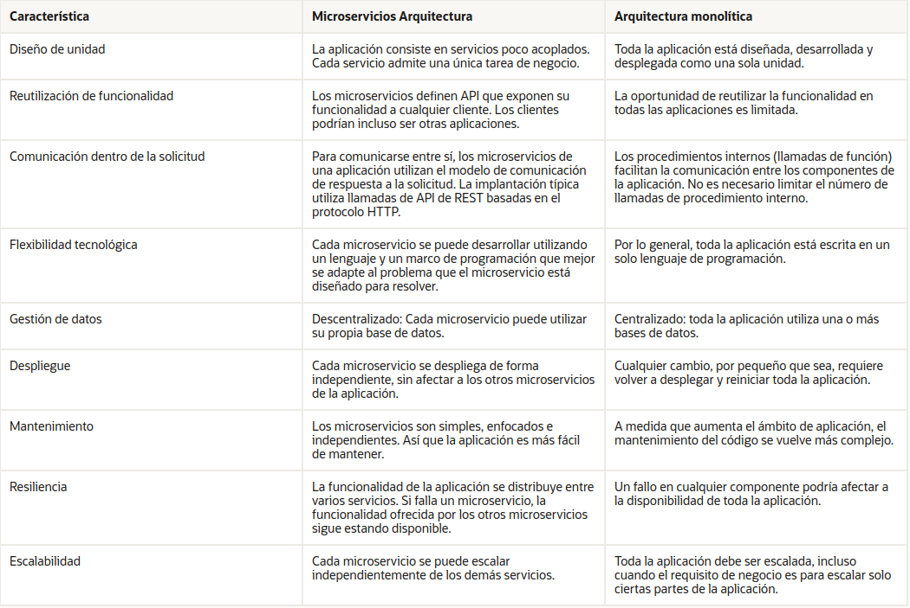
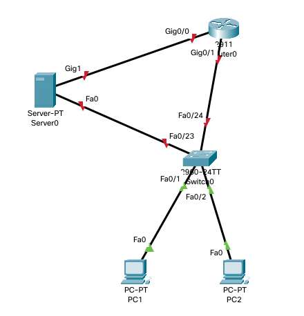

# T1 Bases del despliegue

Duración: 5 horas.\
*Fecha de examen: ??*

## Introducción

+ Base del despliegue.
+ Servicios auxiliares necesarios.
+ Métodos de despliegue

## Arquitecturas web.

## Modelos software.
+ Arquitectura monolítica.
+ Arquitectura de microservicios.
	

	


+ Arquitectura de capas. Frontend - Backend - Almacenamiento
	
+ No confundir con patrones de diseño:
  - Modelo MVC
  - Modelo MVP
  - Modelo MVVM \
	

## Protocolos HTTP.
### Protocolo HTTP.
+ Versiones 1 2: conexiones http y https sobre TCP, puertos 80 y 443 respectivamente.
+ [http1.1 - RFC2616](https://www.rfc-editor.org/rfc/rfc2616) - La más usada
>**Operativa:**
>Es un protocolo de solicitud/respuesta.
>+ Un cliente realiza una solicitud similar a MIME (MUltipurpose Internet Mail Extensions), normalmente GET
>+ El servidor devuelve el código de estado (éxito-200 o error-otro código) y un mensaje similar a MIME si procede.

+ [http2.0 - RFC7540](https://www.rfc-editor.org/rfc/rfc7540) - Mejoras se enfocan en como se empaquetan los datos y en el transporte

+ [http3 - borrador](https://quicwg.org/base-drafts/draft-ietf-quic-http.html) **SIEMPRE** https pero sobre **UDP** (puerto 443) - Mejoras en la conexión rápida ya que solo la primera conexión requiere el intercambio de mensajes previos para el cifrado.
#### Ejercicios
Consultar cabezeras http con `curl -I`
Analizar las respuestas de:
```
curl -I mail.google.com
curl -I amazon.es
curl -I https://amazon.es
curl -I https://www.amazon.es
curl -I https://www.amazon.com
```
[curl - ampliado](https://techexpert.tips/ubuntu/curl-get-headers-only/)

#### Tabajo (futuro)
Montar servidor con soporte HTTPv3
+ [nginx http3](https://github.com/macbre/docker-nginx-http3)
+ [Montar servidor con soporte HTTPv3](https://blog.cloudflare.com/experiment-with-http-3-using-nginx-and-quiche/).


### Prototolo HTTPs
+ SSL
+ TLS
+ Certificados -> Let's encrypt
[Criptografía asimétrica](https://www.youtube.com/watch?v=hRW_9Ck36Xc)

### Métodos
+ GET -> obtener
+ POST -> añadir
+ PUT -> modificar (todo el recurso)
+ PATCH -> modificar (parcialmente)
+ DELETE -> borrar
+ Otros... (no nos interesan para nuestro objeto de estudio).

[Métodos MDN](https://developer.mozilla.org/es/docs/Web/HTTP/Methods) \
[API REST](https://www.oscarblancarteblog.com/2018/12/03/metodos-http-rest/) \
[Qué es una API REST](https://rockcontent.com/es/blog/api-rest/)

#### Juego:
Juega con la API REST de muestra ofrecida por [GoREST](https://gorest.co.in/)
+ GET:
  - Todos: curl https://gorest.co.in/public/v2/users
  - Uno: curl https://gorest.co.in/public/v2/users/2936
+ Para POST, PUT, PATCH y DELETE requerimos autenticarnos y pasarle los datos a cambiar... \
*El uso de curl con datos:*
```
curl --header "Content-Type: application/json" \
     --request POST \
     --data '{"username":"xyz","password":"xyz"}' \
     http://gorest.co.in/api/login
```

*También podéis usar [ReqBin](https://reqbin.com/ "REQ BIN")*


### Códigos de respuesta
+ [Status Codes](https://httpstatuses.io/)
+ [en vídeo](https://www.youtube.com/watch?v=LYprAkna7Z4)
+ [Cats Codes](https://httpcats.com/) 🐈


## Pila TCP/IP
+ Modelo de capas
+ Direccionamiento IP
  - Clases (obsoleto).
  - CIDR (Enrutamiento [interdominio] sin clases).
  - VLSM (Máscara de red de longitud variable).
  - IPs de relevancia:
```
   | IPv4               | IPv6            | Nombre / Significado                          |
   |--------------------+-----------------+-----------------------------------------------|
   | 0.0.0.0/32         | ::/0            | wildcard (comodín)                            |
   |                    | ::/128          | sin especificar                               |
   | 127.X.X.X/8        | ::1/128         | loopback (el propio host )                    |
   | 10.X.X.X/8         | fc00::/7        | Redes priv (con *hasta* 2^24 - 2 host IPv4)   |
   | 172.16.X.X/12      |                 | Redes priv (con *hasta* 2^20 - 2 host IPv4)   |
   | 192.168.X.X/16     |                 | Redes priv (con *hasta* 2^24 - 2 host IPv4)   |
   | 255.255.255.255/32 | -No existe-     | Difusión                                      |
   |                    | ff01::1/128     | All nodes (similar a difusión)                |
   |                    | 2001::/32       | Túnel Teredo (conexión 6to4)                  |
   |                    | ::/96           | IPv4 compatible *NO usar*.                    |
   |                    | ::ffff:0:0/96   | IPv4 mapeada                                  |
   |                    | ::ffff:0:0:0/96 | IPv4 traducida                                |
   |                    | 64:ff9b::/96    | prefijo Well-know (IPv4 traducida automática) |
   | 192.88.99.0/24     | 2002::/16       | red 6to4                                      |
   |--------------------+-----------------+-----------------------------------------------|
   | Públicas           |                 |                                               |
   |--------------------+-----------------+-----------------------------------------------|
   | 169.254.X.X/16     | fe80::/10       | link-local -> no hay DHCP y hay conf dinámica |
   | 192.168.122.X/24   |                 | Red NAT de Virtual Box                        |
```
> (*) Lista no exhaustiva de ips de relevancia.

### Concepto de socket:
IP+Puerto => identificación de un servicio de manera única.

#### Ejerccios:
Ver sockets activos en el servidor:
   + Equipo propio:
```
$ ss -tapon
# ss -tapon
$ netstat -tapon
# netstat -tapon
$ lsof -i -P -n
```
> $ para usuario sin privilegios y # para root. Éste segundo nos dará información más detallada, como el nombre de los procesos entre otros.
   + Otro equipo:
```
$ nc -vc IP PUERTO
$ nmap IP
$ nmap IP/CIDR
```

> Para Windows (poco habitual en servidores: \
> Información de puestos y conexiones:
>> CMD:	netstat -ano \
>>		netstat -abno \
>> PS:	Test-NetConnection IP -Port PUERTO \
>
> Información de rutas:
>> CMD:	route print
>
> Extra: Información sobre los procesos
>> CMD:	tasklist /FI "pid eq NUM_PID_DEL_PROCESO" /V /FO List

# Tareas (entregables):
1. Dado el mapa de red, asigna direcciones de forma coherente y razonada a TODOS los dispositivos en sus interfaces de capa 3. \

2. Obtén las cabeceras de una petición GET a *amazon.es* pero disfrazando el *user-agent* para parecer un Firefox versión 105.0.1.
3. Sobre un entorno linux (virtualizado o no), investiga todas los procesos con referencias a los puertos 67 y 68 y cómo interactuán. \
   Info: si la máquina está virtualizada esté conectada directamente a la red lan sin NAT. \
   P.D.: Un par de párrafos por puerto serán suficientes para demostar que sabes sus funciones.

> Fecha de entrega: 4 de octubre. \
> Forma de entrega: Sibir como README.md a repositorio privado en una carpeta T1-BasesDelDespligue y compartir con @luiscastelar.

---
*Fin de tema*
